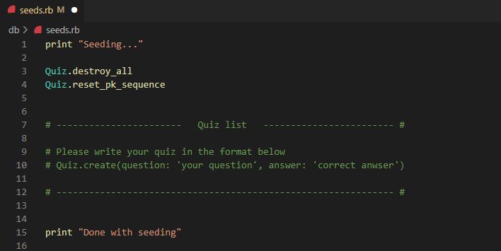
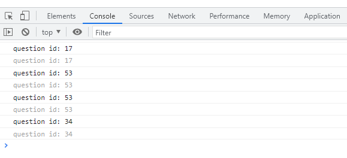

# Flashcard
a project by Yoojin Cheong

## About
Flashcard is an app that helps you memorize while studying. All you need to do is making your own 'quiz', just like writing on flashcards.

## Instruction

* To set up the frontend and backend, from the root directory, run:

```console
$ npm install --prefix client
$ bundle install
```

* Please make your own quizzes in the format as written in the seed.rb. 


<br></br>

* After completing writing quizzes, please run the Rails application in one terminal by running:

```console
$ rails s
```

* Then, **open another terminal** and run React:

```console
$ npm start --prefix client
```

* Flashcard app will run on the port: [http://localhost:4000](http://localhost:4000)

## Features

- **Next**: Generating a random question. You should click it whenever a next question is needed.

- **Submit**: Please click after you wirte an answer.

- **Answer**: Please click the answer button if you can't come up with an answer

## Revising

When you find a mis-spelled question or want to change it, there is an easy way to query the database. When you open the console, it will give you the ID number the current question belongs to, making it easy to search the database.


